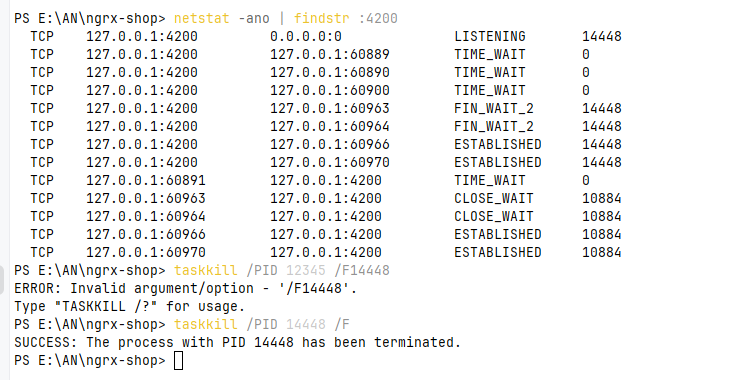

## 1. initial

1.1. calc (100vh - $header ...) - doesn`t put values $header!

use css variables instead!

1.2. vercel doesn`t work with node 14

use github actions instead

## 2. setup ngrx

### 2.1. install ngrx

version: 9

```
npm install @ngrx/store@9
```

### 2.2. install @ngrx/store-devtools

```
npm install @ngrx/store-devtools@9
```

### 3. how to kill unclosed server:



```
netstat -ano | findstr :4200
taskkill /PID 12345 /F
```

